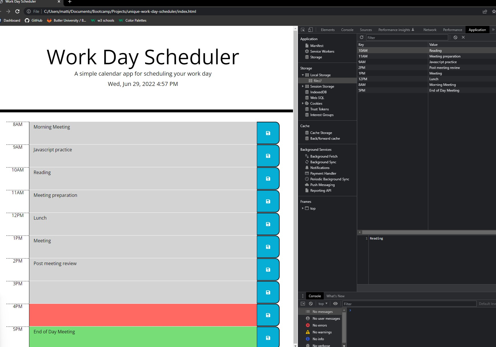

# Work-Day-Scheduler

my github

### Summary
* Work day scheduler for hourly events
* With the use of local storage, the events will stay even with a page refresh

!!{}(assets/images/workday-full.jpg)

### The project layout
* The user can input their event for the hour in the blanks
* The user can save their event using the button on the right
* The user can refresh the page to see the time will refresh also with the correct color for each hour

* Local storage example

### Features
* HTML
* CSS
* JS
* Bootcamp
